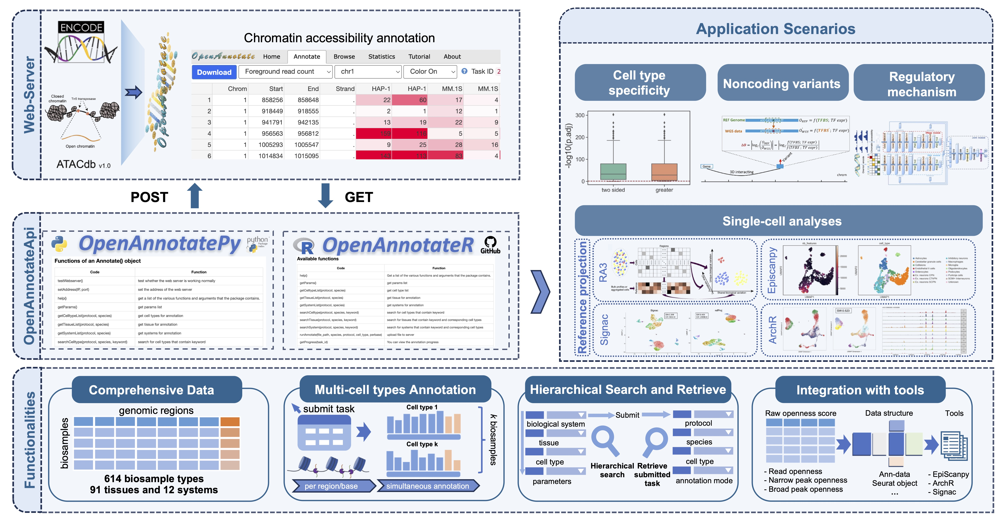

# OpenAnnotateR

#### A R package for efficiently annotating the chromatin accessibility of genomic regions

<div align=center>

</div>  

Chromatin accessibility is a measure of the ability of nuclear macromolecules to physically contact DNA, and is essential for understanding regulatory mechanisms.

OpenAnnotateR facilitates the chromatin accessibility annotation for massive genomic regions by allowing ultra-efficient annotation across various biosample types based on chromatin accessibility profiles accumulated in public repositories (1236 samples from ENCODE and 1493 samples from ATACdb).

For more information, please refer to the web: http://health.tsinghua.edu.cn/openannotate/

### Install OpenAnnotateR via devtools

OpenAnnotateR is available on github here and can be installed via `devtools`, make sure you have installed `devtools` fist
```R
devtools::install_github("ZjGaothu/OpenAnnotateR")
```

### Available functions

| Code | Function |
| ------ | ------  |
| help() | Get a list of the various functions and arguments that the package contains. |
| getParams() | get params list |
| getCelltypeList(protocol, species) | get cell type list |
| getTissueList(protocol, species) | get tissue for annotation |
| getSystemList(protocol, species) | get systems for annotation|
| getResultList() | get the list of result type|
| searchCelltype(protocol, species, keyword) | search for cell types that contain keyword |
| searchTissue(protocol, species, keyword) | search for tissues that contain keyword and corresponding cell types|
| searchSystem(protocol, species, keyword) | search for systems that contain keyword and corresponding cell types|
| runAnnotate(file_path, species, protocol, perbase) | upload file to server |
| getProgress(task_id)| You can view the annotation progress |
| getAnnoResult(result_type, cell_types, task_id) | Download the annotation result |
| getInputFile(save_path, task_id) | get your input file from server |
| viewParams(task_id) | view parameters|
| getExampleTaskID() | get example task id|
| getExampleInputFile(save_path) | get example input file to the save_path|
| Openness2Seurat(file_path,header_path) | convert the openness score to a seurat object|

### A simple example


Upload a region file to the web server and download the head and the readopen of the annotation result to the local path, then initialize an seurat object for downstream analysis.

```r
library(OpenAnnotateR)

getParams()

getCelltypeList(protocol=1, species=1)

getExampleInputFile('.')

task_id <- runAnnotate('./EXAMPLE.bed.gz', species=1, protocol=1, perbase=2)

getResultList()

getAnnoResult(result_type=1, cell_types=c(2,8,9), task_id)

ref_seurat <- Openness2Seurat(paste('./results/',task_id,'_readopen.txt',sep=''),paste('./results/',task_id,'_head.txt',sep=''))

```
### Tutorial

**Import**

We first import the package and query the parameters that need to be set.


```r
library(OpenAnnotateR)
```


**Help**

Get a list of the various functions and arguments that the package contains.
```r
oaa.help()
'''
 "getParams() : get params list"
 "getCelltypeList(protocol, species) : get cell type list"
 "getTissueList(protocol, species) : get tissue list"
 "getSystemList(protocol, species) : get system list"
 "searchCelltype(protocol, species, keyword) : search for cell types that contain keyword"
 "searchTissue(protocol, species, keyword) : search for tissues that contain keyword and corresponding cell types"
 "searchSystem(protocol, species, keyword) : search for systems that contain keyword and corresponding cell types"
 "runAnnotate(file_path, species, protocol, perbase) : upload file to server"
 "getProgress(task_id)"
 "getAnnoResult(result_type, save_path, task_id)"
 "getInputFile(save_path, task_id) : get your input file from server"
 "viewParams(task_id) : view parameters"
 "exampleTaskID() : get example task id"
 "exampleInputFile(save_path) : get example input file to the save_path"
 "Openness2Seurat(file_path) : convert the openness score to a seurat object"
'''
```


**Get Input File**
In order to know the format of the input file, we have an example input file stored on the server, which can be downloaded to the local path by:

```r
getExampleInputFile('.')
# get the result to ./EXAMPLE.bed.gz
```
**Run Annotate**
Then we can annotate the genomic regions by using the function and providing the corresponding parameters.
```r
task_id <- runAnnotate('EXAMPLE.bed.gz',species = 1,protocol = 1,perbase = 1)
# species :
# 1 - GRCh37/hg19
# 2 - GRCh38/hg38
# 3 - GRCm37/mm9
# 4 - GRCm38/mm10
# protocol :
# 1 - DNase-seq(ENCODE)
# 2 - ATAC-seq(ENCODE)
# 3 - ATAC-seq(ATACdb)
# perbase : 
# 1 - Region based
# 2 - Per-base based
```

- `species` : 
  - 1 : GRCh37/hg19 
  - 2 : GRCh38/hg38 
  - 3 : GRCm37/mm9 
  - 4 : GRCm38/mm10
- `protocol`: 
  - 1 : DNase-seq(ENCODE)
  - 2 : ATAC-seq(ENCODE) 
  - 3 : ATAC-seq(ATACdb)
- `perbase`: 1 : Region based,2 : Per-base based.

**Download the Result**
Before downloading the results, you need to query the progress of the annotation task and download the results file when the task is complete.
```r
getProgress(task_id=2023122816325392)
# Your task has been completed!
# You can get the result file type first through getResultList()
# You can download result file through getAnnoResult(result_type, cell_type, 2023122816325392)
```
Following the notes, query the types of result by
```r
getResultList()
# 1 - head
# 2 - readopen
# 3 - peakopen
# 4 - spotopen
# 5 - foreread
```

Users can search for specific systems, tissues, and cell types using keywords.
```r
searchSystem(protocol=1,species=1,keyword='U')
searchTissue(protocol=1,species=1,keyword='U')
searchCelltyp(protocol=1,species=1,keyword='K562')
```

- `species` : 
  - 1 : GRCh37/hg19 
  - 2 : GRCh38/hg38 
  - 3 : GRCm37/mm9 
  - 4 : GRCm38/mm10
- `protocol`: 
  - 1 : DNase-seq(ENCODE)
  - 2 : ATAC-seq(ENCODE) 
  - 3 : ATAC-seq(ATACdb)
- `keyword`: Key word for search. Such as `K562` and `Blood`.

Download the readopen of the annotation result.

```r
getAnnoResult(result_type = 2,cell_types = c(2,3,4),task_id = 2023122816325392)
# get the result to ./results/2023122816325392_readopen.txt
```


**View Task Information**
We can also view the previous tasks’ information by
```r
viewParams(task_id = 2021080911093988)
# Your task's parameters:
# Protocol: DNase-seq(ENCODE)
# Species: GRCh37/hg19
# Cell type: All biosample types
# Annotate mode: region based
getInputFile('.',2021080911093988)
# get the result to ./2021080911093988.bed
```

**Convert to Seurat object**
To better integrate with single-cell analysis, users can directly convert the results into a Seurat object.

```r
ref_seurat <- Openness2Seurat('./results/2023122110412810_readopen.txt')
```
